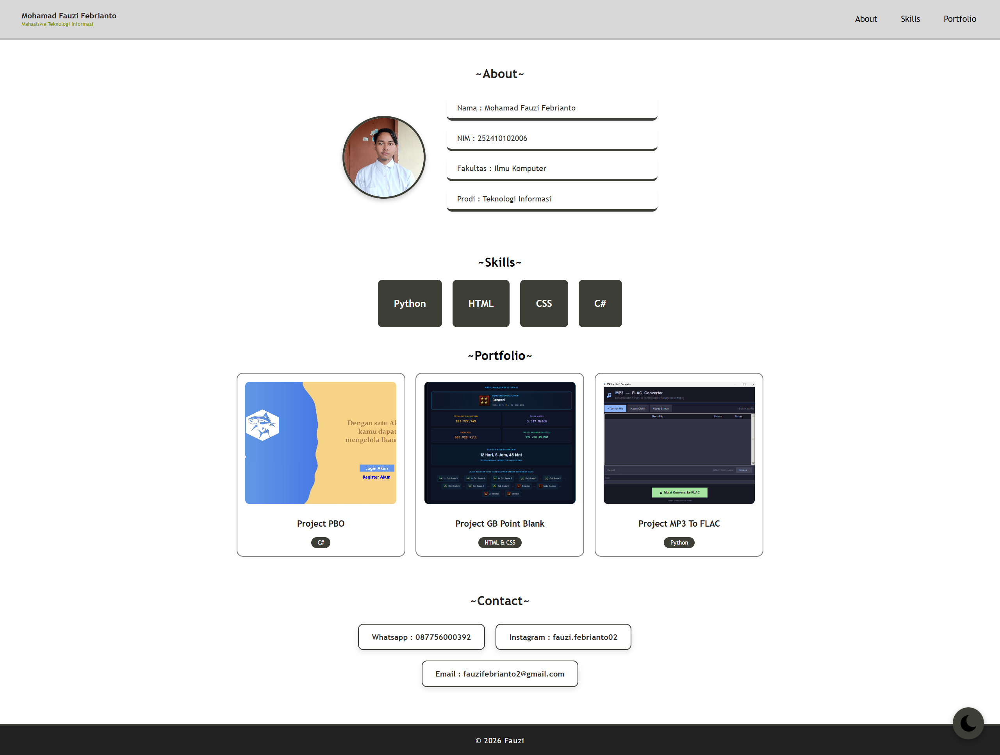
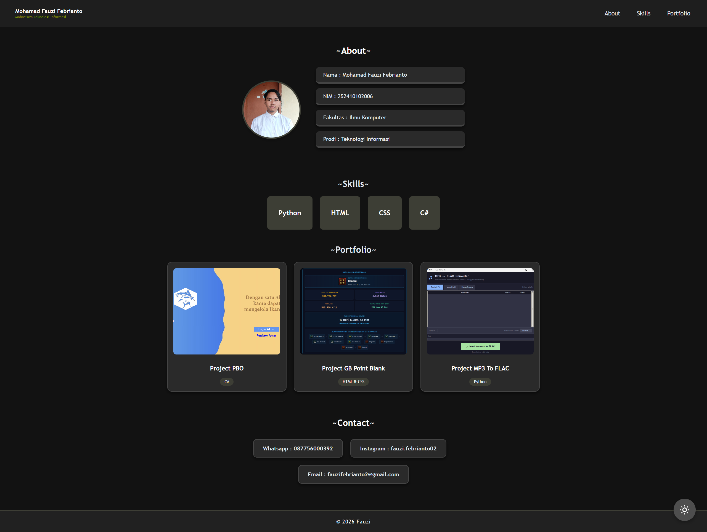
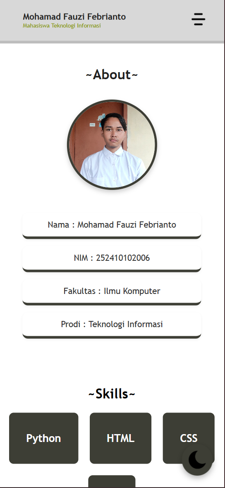
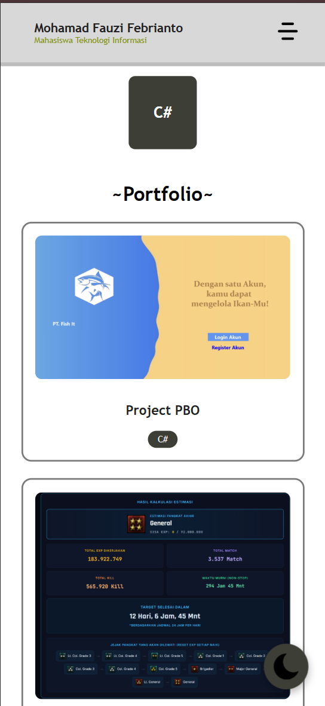
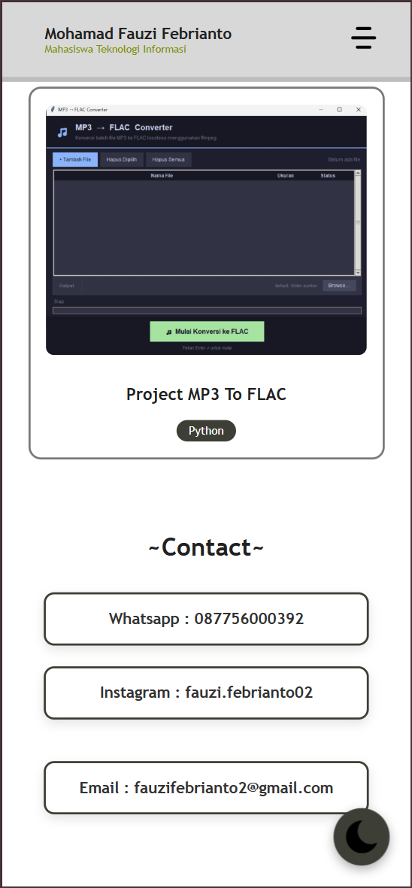
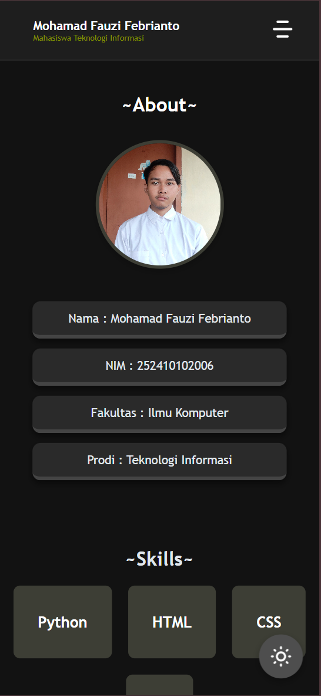
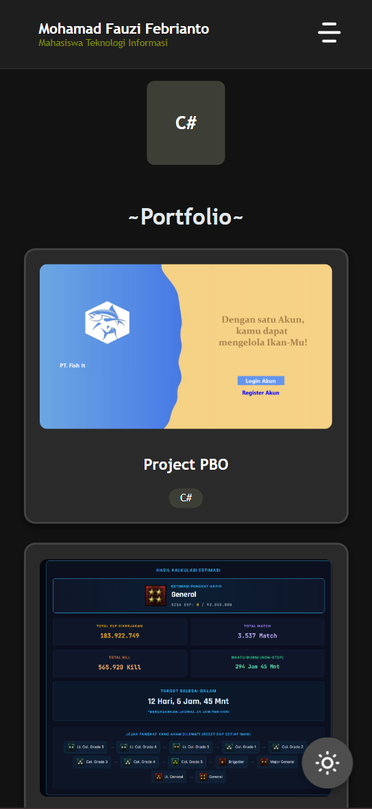
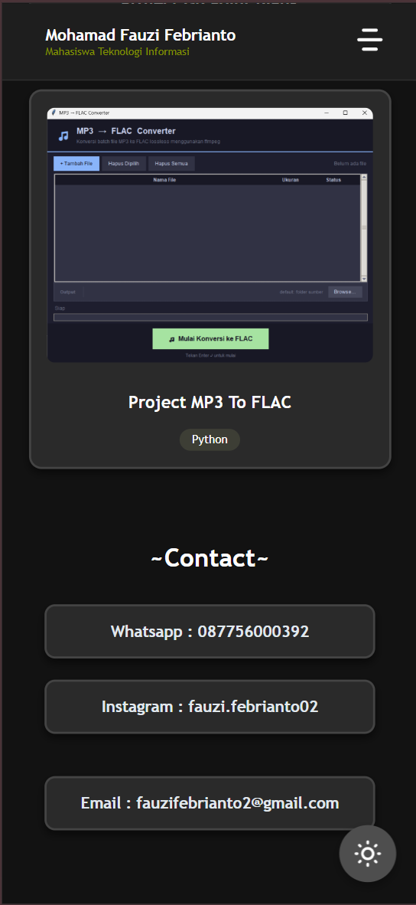

Website Profil & Portofolio Mahasiswa

Repositori ini berisi tugas pembuatan website profil dan portofolio responsif untuk memenuhi tugas Praktikum Pemrograman Web (Minggu 5). Website ini dibangun menggunakan HTML, CSS, dan manipulasi DOM JavaScript sederhana.

Penulis
Nama : Mohamad Fauzi Febrianto
Program Studi : Teknologi Informasi
Universitas : Universitas Jember

Fitur Utama
1. Responsive Design: Tata letak (layout) website secara otomatis menyesuaikan ukuran layar (Desktop, Tablet, dan Mobile).
2. Dark Mode (Tema Gelap): Terdapat tombol toggle melayang (floating button) yang berfungsi untuk mengganti tema website antara terang dan gelap.
3. Hamburger Menu: Menu navigasi interaktif pada tampilan mobile (layar kecil) yang menggunakan manipulasi DOM JavaScript.

Bahan yang Digunakan
HTML
CSS (Style)
JavaScript (DOM Manipulation)

Screenshot Tampilan Website (SS)

1. Tampilan Desktop (Light Mode)

2. Tampilan Desktop (Dark Mode)

3. Tampilan Mobile (Light Mode)

5. Tampilan Mobile (Light Mode)

